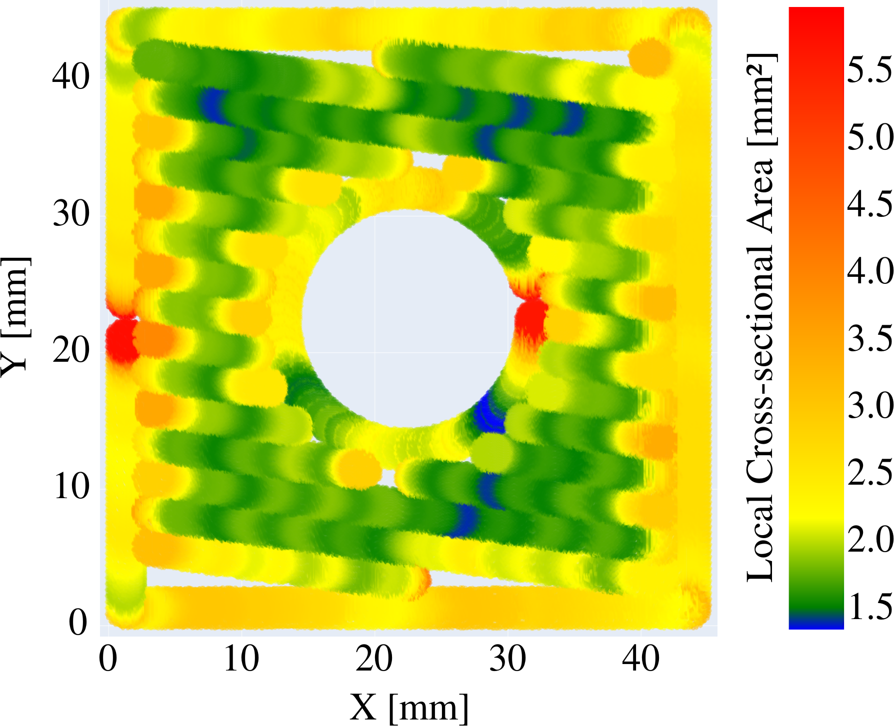
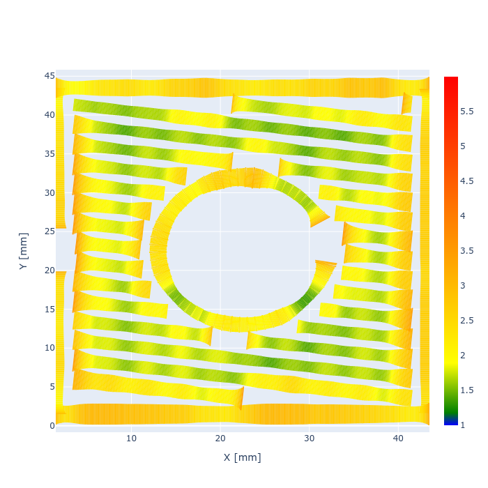

# Volume calculation postprocessor
This is a proof of concept implementation of the bead volume calculation method introduced in:
"M. Wolf, V. Maier, and A. Verl, „Method for the Calculation of Local Bead Volume in Multi-Axis Additive Manufacturing“, Procedia CIRP, 2023."

It is capable of processing a provided STL model and G-Code, re-calculate the extruded volume and output adjusted G-Code along with some graphs.

## Installation
Create a virtual environment and install the prerequisites.

```bash
~$ python -m venv .venv
~$ source .venv/bin/activate
~$ pip install -r requirements.txt
```
## Usage
The tool has been tested (not exclusively) with the bundled paths and models. These have been sliced with [Cura](https://ultimaker.com/software/ultimaker-cura/) and exported to the "Marlin" G-Code flavor. Other flavors may also work, but have not been tested.

The bundled examples include pre-voxelized meshes and can be used after extraction:
```bash
~$ find . -iname "*.binvox.zst" -exec zstd -d {}\;
```
Voxelization has been done with [Cuda Voxelizer](https://github.com/Forceflow/cuda_voxelizer) and saved to the [binvox](https://www.patrickmin.com/binvox/binvox.html) format. If you wish to use your own models, provide your own binary of Cuda Voxelizer at `./external/cuda_voxelizer`. The tool will cache and/or look for a voxelization of the models in the parent folder of the model according to the following naming pattern `/path/to/model.stl_{grid dimension}.binvox`. Note that the voxelized models have to be aligned with the sliced paths. The easiest way to achieve that is to reposition the STL so that it doesn't have to be moved in the Voxelizer or the Slicer.


The calculation can be triggered by. It will open some visualizations after processing. These can be ignored.
```bash
~$ python main.py parameters.yaml model.stl input_paths.nc output_paths.nc
```

## Parameter file
Please provide a yaml parameter file for each model that you want to process:
```yaml
# The maximal edge length of a single voxel [mm]. This is used for voxelization.
voxelsize: 0.05
# Filament diameter: Only relevant for the calculation of the slicer output
filament_diameter: 1.75
# Maximal length of a path segment [mm]. Longer segments will be split. This is necessary to calculate and output higher resolution volume data.
interpolate_length: 1
# A translation in [x, y, z] [mm] to correct alignment of the paths with the voxelized model. Rotation is not supported.
registration: [0.9, 0, 0.04]

# Bead shape
bead:
  width:
    minimal: 0.3
    nominal: 0.5
    maximal: 0.8
  height:
    minimal: 0.075
    nominal: 0.15
    maximal: 0.35
```


## Running the tests
```bash
~$ source .venv/bin/activate
~$ python TestWithHoleIterative.py
```

## Acknowledgement
This project uses several external resources for various tasks.
* [`binvox_rw`](https://github.com/pclausen/binvox-rw-py): interaction with the binvox format. Our fork is bundled in [`external/binvox-rw-py`](external/binvox-rw-py)
* [cuda voxelizer](https://github.com/Forceflow/cuda_voxelizer): Mesh voxelization. This is not included and needs to be installed separately.
* [GcodeParser](https://github.com/AndyEveritt/GcodeParser): used to parse G-Code ;)
* [numpy](https://numpy.org/): Fast maths.
* [plotly](https://plotly.com/python/): Plotting in the browser
* [pyyaml](https://pyyaml.org/): Parsing configuration files.
* [scipy](https://scipy.org/): Fast maths.
* [trimesh](https://trimesh.org/) is used to determine the necessary voxel grid size from a stl

# Appendix to the publication
The published paper contains this figure (figure 8):



The plotting method used to generate this figure introduces a shift, which was noted in the publication. This is due to later path segments partly overpainting older (i.e. printed earlier) path segments, as the tips of the segments overlap and the segements are fully painted in sequence. This results in a wavy depiction that might be irritating at first, but properly represents the coverage of the layer with the resulting paths.\\

For better clarity, the method shown below does not re-use voxels to paint the paths, but variable thickness line plots. So here the path segments do not overlap anymore, and no shifting is introduced. Note however, that with this method the width of the paths is not up to scale and in fact is scaled by the cross-sectional area. Thereby it also corresponds to changes in height, rather than just the width.

